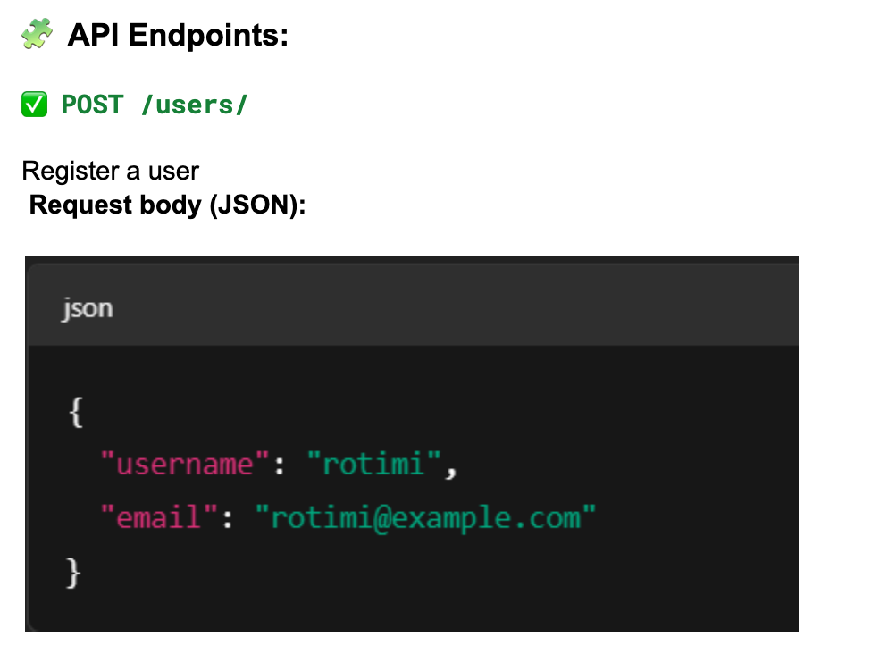
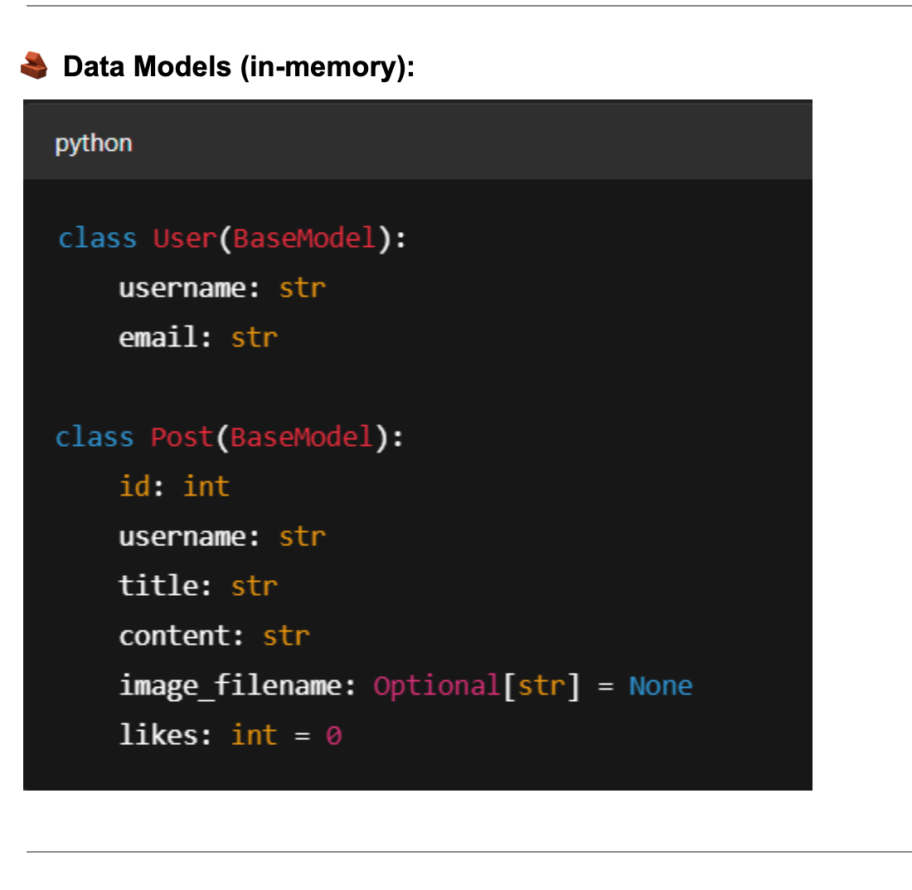

Endpoinnt to Create

🔹 Project 1: Mini Social Media Feed
📌 Project Overview:
Build a backend API for a simple social media app where users can post messages, optionally upload images, and like other users' posts.

🧩 API Endpoints:
✅ POST /users/
Register a user
 Request body (JSON):
 

✅ POST /posts/
Create a post (supports file upload)

Form fields:
username (Form)
title (Form)
content (Form)
image (Optional File)

✅ GET /posts/
List all posts

✅ GET /users/{username}/posts
List all posts by a user

✅ POST /posts/{post_id}/like
Like a post

👥 Suggested Team Roles:
User registration and user-related routes
Post creation with file handling
Feed listing and user filter
Like functionality and counters
